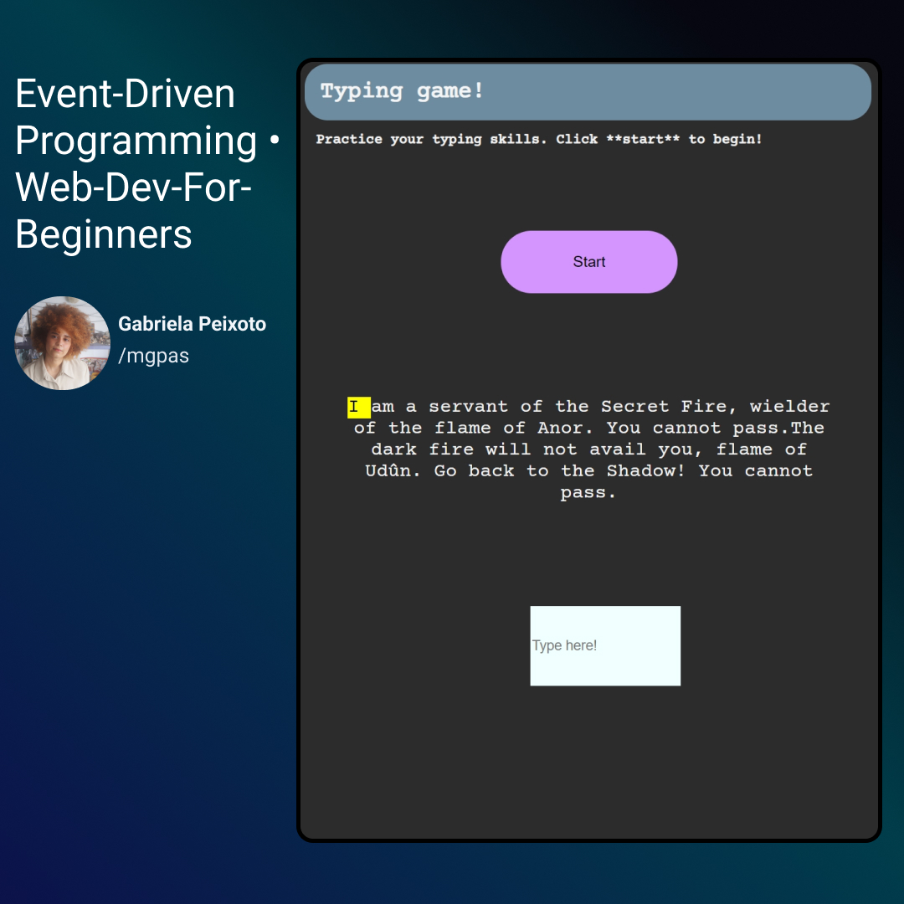

<h1 align="center"> Typing Quotes Game! </h1>

Jogo de digitação com quotes literárias.

  <a href="#-tecnologias">Tecnologias</a>&nbsp;&nbsp;&nbsp;|&nbsp;&nbsp;&nbsp;
  <a href="#-projeto">Projeto</a>&nbsp;&nbsp;&nbsp;|&nbsp;&nbsp;&nbsp;
  <a href="#memo-licença">Licença</a>

  

 

  

## 🚀 Tecnologias

Esse projeto foi desenvolvido com as seguintes tecnologias:

- HTML e CSS
- JavaScript
- Git e Github

## 💻 Projeto

O Typing Quotes Game é um projeto de jogo de digitação que mostra o tempo levado para digitar frases de personagens de livros. O jogo foi feito a partir de curso disponibilizado no GitHub da Microsoft [Web-Dev-For-Beginners](https://github.com/microsoft/Web-Dev-For-Beginners/tree/main/4-typing-game).

## :memo: Licença

Esse projeto está sob a licença MIT.

---

Feito com ♥ by Microsoft, /mgpas :wave:
